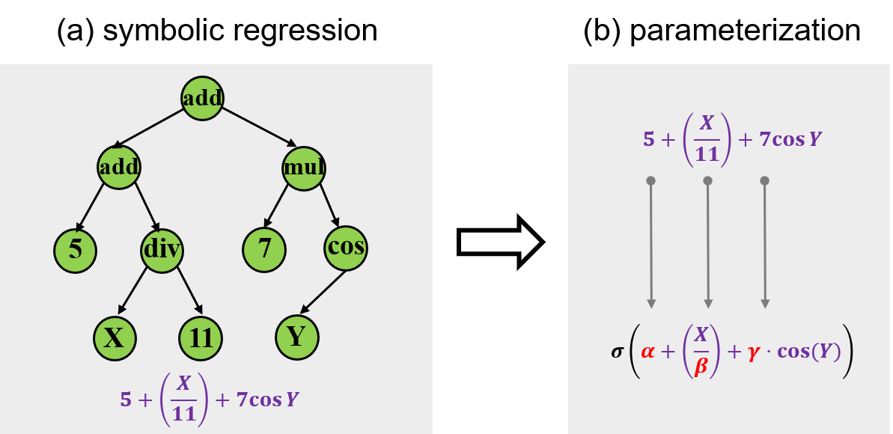
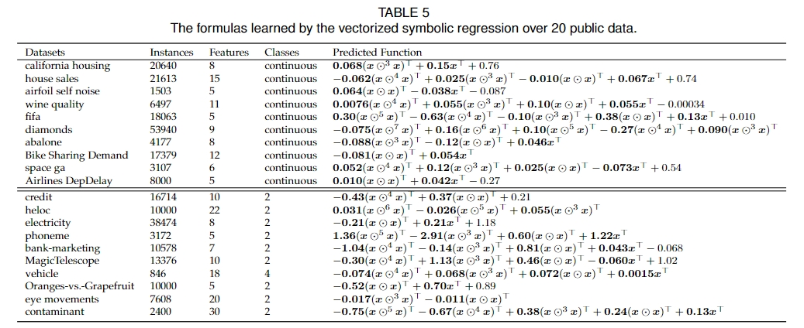
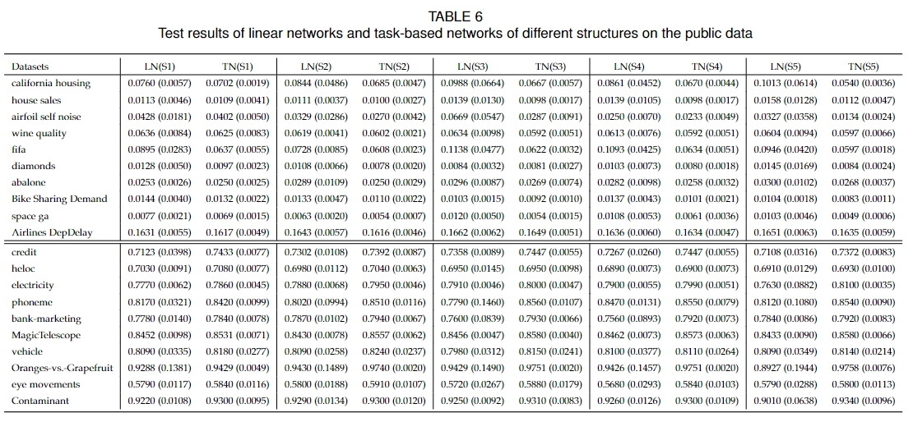

<div align="center">
  
</div>

 Tnlearn is an open source python library. It is based on the symbolic regression algorithm to generate task-based neurons, and then utilizes diverse neurons to build neural networks.

  


# Quick links

* [Motivation](#Motivation)

* [Features](#features)

* [Method framework](#Methodframework)

* [Benchmarks](#Benchmarks)

* [Dependences](#Dependences)

* [Install](#install)

* [Quick start](#Quick start)

* [API documentation](#API-documentation)

* [Citation](#citation)

* [The Team](#TheTeam)

* [License](#License)

  

# Motivation

In the past decade, many successful networks are on novel architectures, which almost exclusively use the same type of neurons. Recently, more and more deep learning studies have been inspired by the idea of NeuroAI and the neuronal diversity observed in human brains, leading to the proposal of novel artificial neuron designs. Designing well-performing neurons represents a new dimension relative to designing well-performing neural architectures. Biologically, the brain does not rely on a single type of neuron that universally functions in all aspects. Instead, it acts as a sophisticated designer of task-based neurons. 

Since the human brain is a task-based neuron user, can the artificial network design go from the task-based architecture design to the task-based neuron design? 

Since methodologically there are no one-size-fits-all neurons, given the same structure, task-based neurons can enhance the feature representation ability relative to the existing universal neurons due to the intrinsic inductive bias for the task. 


# Features

We propose a two-step framework for prototyping task-based neurons. First, symbolic regression is used to identify optimal formulas that fit input data by utilizing base functions such as logarithmic, trigonometric, and exponential functions. We introduce vectorized symbolic regression that stacks all variables in a vector and regularizes each input variable to perform the same computation, which can expedite the regression speed, facilitate parallel computation, and avoid overfitting. Second, we parameterize the acquired elementary formula to make parameters learnable, which serves as the aggregation function of the neuron. The activation functions such as ReLU and the sigmoidal functions remain the same because they have proven to be good. 


# Method framework

<div align="center">
  
</div>


* First, we introduce vectorized symbolic regression to construct an elementary neuronal model (Figure a). Symbolic regression draws inspiration from scientific discoveries in physics, aiming to identify optimal formulas that fit input data by utilizing base functions such as logarithmic, trigonometric, and exponential functions. The vectorized symbolic regression stacks all variables in a vector and regularizes each input variable to perform the same computation. Given the complexity and unclear nonlinearity of the tasks, formulas learned from vectorized symbolic regression can capture the underlying patterns in the data, and these patterns are different in different contexts. Thus, fixed formulas used in pre-designed neurons are disadvantageous.
* Second, we parameterize the acquired elementary formula to make parameters learnable (Figure b), which serves as the aggregation function of the neuron. The role of the vectorized symbolic regression is to identify the basic patterns behind data, the parameterization allows the task-based neurons to adapt and interact with each other within a network.


# Benchmarks

We first perform the vectorized symbolic regression on the normalized dataset. The relevant information regarding these 20 datasets, and the regression results are shown in Table 5.

<div align="center">
  
</div>

Here, we test the superiority of task-based neurons relative to linear ones. We use the same 20 datasets in the last subsection: 10 for regression and 10 for classification. We don't need to repeat the process of the vectorized symbolic regression. Instead, we directly use polynomials learned in Table 5. The training and test sets are divided according to the ratio of $8:2$. For *TN*  and *LN*, the data division and the batch size are the same. We select 5 different network structures for each dataset for a comprehensive comparison. When designing the network structures of *TN*, we ensure that the number of parameters of *TN* is fewer than the *LN* to show the superiority of task-based neurons in efficiency. The specific network structure and corresponding number of parameters are shown in SMs. Each dataset is tested 10 times for reliability of results. The MSE and classification accuracy are presented in the form of $\mathrm{mean}~(\mathrm{std})$ in Table 6.

<div align="center">
  
</div>


# Dependences

You should ensure that the version of pytorch corresponds to the version of cuda so that gpu acceleration can be guaranteed. Here is a reference version

`Pytorch 2.1.0`

`cuda 12.1`

Other major dependencies are automatically installed when installing tnlearn.


# Install

Tnlearn and its dependencies can be easily installed with pip:

```shell
pip install tnlearn
```


# Quick start

This is a quick example to show you how to use tnlearn in regression tasks. Note that your data types should be tabular data.

```python
from tnlearn import Regressor
from tnlearn import MLPRegressor

# A symbolic regression algorithm is used to generate task-based neurons.
neuron = Regressor()
neuron.fit(X_train, y_train)

# Build neural network using task-based neurons and train it.
clf = MLPRegressor(neurons=neuron.neuron)
clf.fit(X_train, y_train)

# Predict
clf.predict(X_test)
```


There are many hyperparameters in tnlearn that can be debugged, making the neural network performance more superior. Please see the  [API documentation](#API documentation) for specific usage.


# API documentation

Here's our official API documentation, available on Read the Docs.


# Citation

If you find Tnlearn useful, please cite it in your publications.

```bibtex
@article{


}
```


# The Team

Tnlearn is a work by [Meng Wang](https://github.com/NewT123-WM), [Juntong Fan](https://github.com/Juntongkuki), and [Fenglei Fan](#https://github.com/FengleiFan).


# License

Tnlearn is released under the BSD 3-Clause License.


